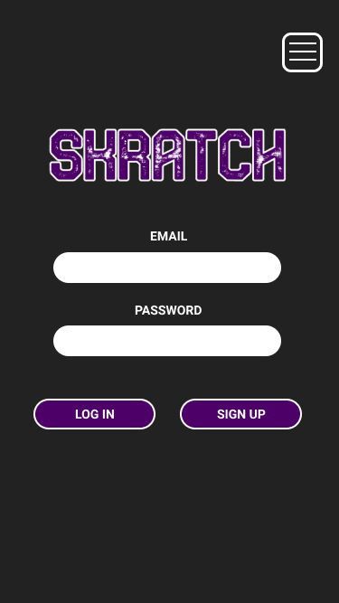
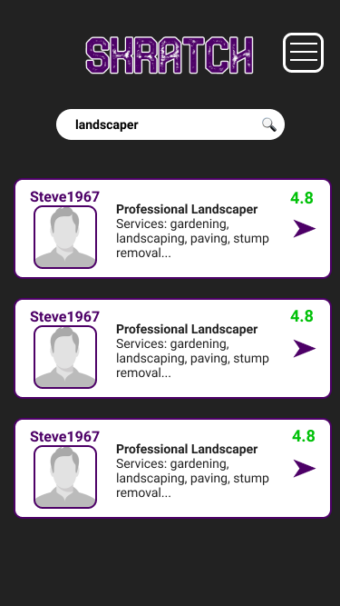
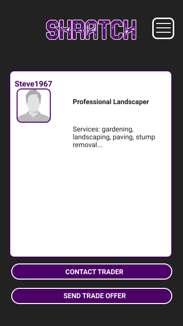
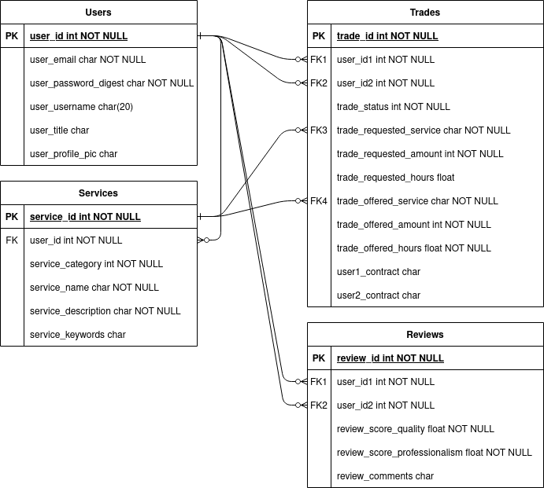

# Skratch Marketplace

## Table of Contents
<!-- TOC -->
- [Table of Contents](#table-of-contents)
- [Overview](#overview)
- [Vision Statement - The Problem of Money](#vision-statement---the-problem-of-money)
- [Skratch](#skratch)
  - [Purpose](#purpose)
  - [Functionality / Features](#functionality--features)
  - [Sitemap](#sitemap)
  - [Target Audience](#target-audience)
  - [Tech Stack](#tech-stack)
  - [User Stories](#user-stories)
  - [Wireframes](#wireframes)
  - [ERD](#erd)
  - [High-Level Components](#high-level-components)
<!-- /TOC -->

## Overview

Skratch is a two-way bartering marketplace where users can agree to exchange services in the form of contracts instead of payment.

## Vision Statement - The Problem of Money

Prior to the introduction of standarised currency, humans traded using a barter system. While currency is useful for facilitating trade and making transactions at correct market value, its original purpose and strength have become undermined over time by the advent of electronic fiat currency and cryptocurrencies, which seek to create value from thin air, and ever-increasing government regulation and taxation. 

Additionally, the same properties of currency that increase the scope of trade across society have also led to us becoming ever more isolated from one another, as it is no longer necessary to establish trust with members of one's community in order to meet one's needs. Humans are increasingly focused on the individualistic pursuit of making more and more money, sacrificing interpersonal relationships, time with their children, and quality of life in the process; we can also simply buy whatever we need from corporations. This encroaching and potentially irrevocable collapse of community, along with the growing gap between rich and poor, signals that a new approach is needed, one that reduces the world's reliance on currency and regenerates the interconnectedness that people so desperately need to be happy and fulfilled.

## Skratch

### Purpose

 Taking into account society's increasing focus on sustainability, community and local produce, it makes sense for an online marketplace to exist that permits like-minded individuals to connect with one another, interact with their local communities, and remove themselves from the financial system as much as possible by exchanging their skills and products in private transactions, providing individuals with greater freedom over their output and reducing the wasteful attrition of GST and other government levies.

While bartering stills exists in various forms today, it suffers from these inherent problems:

- *Availability* - it can be difficult for individuals wishing to engage primarily in barter trade to establish complete supply lines and self-sufficiency due to the increasing isolation of the modern world and its reliance on money. Skratch seeks to solve this problem by creating an extensive global community of traders connected by the Internet and a common purpose.

- *Trust* - in contrast to exchange of goods, it is challenging for individuals dealing with acquaintances or strangers to exchange services when those services will be delivered asynchronously, as promises can be easily broken or the quality of goods or services delivered may not be as expected. Skratch seeks to solve this by having a transparent feedback system that allows users to rate one another, and by requiring users to sign individual contracts with one another, providing copies of these contracts, keeping clear records of all transactions and agreements, and providing a QR-code system to allow individuals to register part delivery of services. 
    - *For example, a gardener and a hairdresser agree to exchange five two-hour gardening sessions for eight one-hour haircuts; Skratch will allow each of these sessions to be validated when used and display a remaining balance of work owed.*

### Functionality / Features

Skratch has the basic building blocks of any two-way marketplace, with the obvious absence of a payment method.

- User Authentication and Authorisation

  - Skratch allows users to create personal user accounts with secure login and password features.

- Listings

  - Skratch works by allowing users to list the service(s) they provide and the dollar amount at which they value these services, then use a category and/or keyword search to find individuals that can provide services that they need.
  
- Trade Offers
  - Once they have located a user that offers the required service, users can then send a request for quotation (RFQ). The recipient of the trade offer will then peruse the offerings of the original user, select one if desired and then respond to the RFQ with a suggested exchange value. This process continues with offers and counteroffers until both parties arrive at a compromise.

- Agreements

  - Once an trade is agreed upon, Skratch sends both participants a personalised contract (nominally an "Agreement") in which they legally consent to the exchange of services. Users digitally sign these, after which copies of the agreements are stored securely on the Skratch server. 

- Cancellation of Agreements

  - Agreements may be cancelled unilaterally if no services have yet been exchanged, or if the services so far exchanged are of equal value. If neither of these conditions are met, a cancellation must be agreed on bilaterally, and if this occurs Skratch will direct the user to make a partial payment for the balance.

- Trust Ratings

  - Users that have engaged in transactions are strongly encouraged to rate each other out of 5 based on how the experience was. An aggregate of these ratings is displayed on the user's profile after a statistically significant number of ratings have been received, allowing users to make informed decisions about who they are potentially dealing with.

### Sitemap

- Landing Page
  - Login
  - Signup
    - TOC/EULA
- Home
  - Profile
    - Update Profile
      - Update Listings
    - Active Agreements
    - Active Trade Offers/Counteroffers
  - Listings
    - Listing
      - Send Trade Offer

### Target Audience

Skratch is primarily aimed at tradespeople and artisans with sole trader capabilities, however anyone with a valuable skill could find benefit in exchanging services on the platform.

### Tech Stack

- HTML5
- CSS3
- Ruby 2.7.2 
- Rails 6
- Heroku (deployment)

### User Stories

- As a sole trader, I want to exchange services on an online platform, so that I can connect with my local community, save money on tax, and reduce the amount of cashflow required to operate.

### Wireframes

### ERD

### High-Level Components

